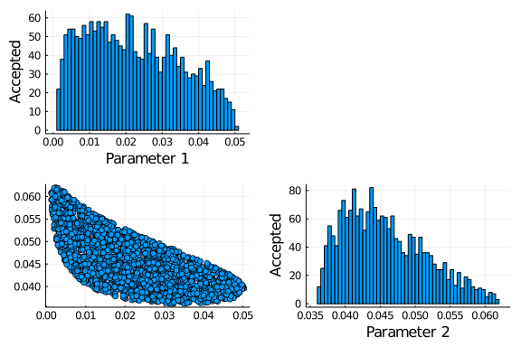
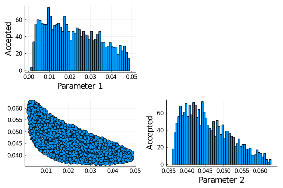
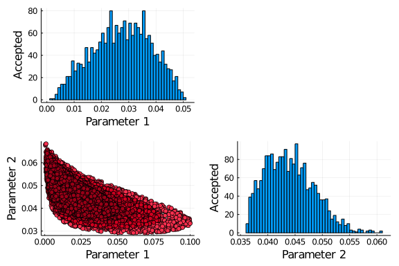
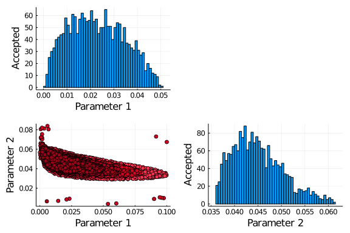
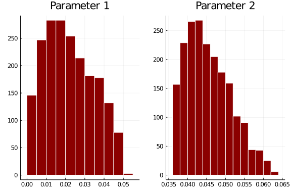
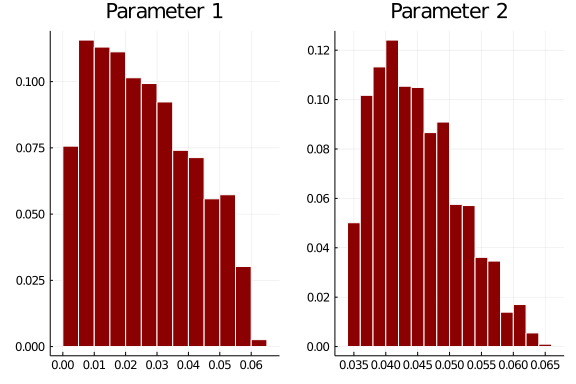

# Ordinary differential equation model with inference using ABC
Simon Frost (@sdwfrost), 2020-05-27

## Introduction

In this notebook, we try to infer the parameter values from a simulated dataset using Approximate Bayesian Computation (ABC).

## Libraries

````julia
using DifferentialEquations
using SimpleDiffEq
using Random
using Distributions
using GpABC
using Distances
using ApproxBayes
using Plots
````


## Model

A variable is included for the number of infections, $Y$.

````julia
function sir_ode!(du,u,p,t)
    (S,I,R,C) = u
    (β,c,γ) = p
    N = S+I+R
    infection = β*c*I/N*S
    recovery = γ*I
    @inbounds begin
        du[1] = -infection
        du[2] = infection - recovery
        du[3] = recovery
        du[4] = infection
    end
    nothing
end;
````


````
sir_ode! (generic function with 1 method)
````


````julia
tmax = 40.0
δt = 1.0
tspan = (0.0,tmax)
obstimes = 1.0:δt:tmax;
u0 = [990.0,10.0,0.0,0.0]; # S,I.R,C
p = [0.05,10.0,0.25]; # β,c,γ
````


````
3-element Array{Float64,1}:
  0.05
 10.0
  0.25
````


````julia
prob_ode = ODEProblem(sir_ode!,u0,tspan,p)
sol_ode = solve(prob_ode,saveat=δt)
out_ode = Array(sol_ode)
C = out_ode[4,:]
X = C[2:end] .- C[1:(end-1)];
````


````
40-element Array{Float64,1}:
  5.5906270179533575
  7.076170331041077
  8.90898222880263
 11.141945688850349
 13.8194328206053
 16.96577631259931
 20.57011040389561
 24.568415983090688
 28.831122852757474
 33.14329091787582
  ⋮
  5.623429741450877
  4.811473903557044
  4.118599256569951
  3.528865336511103
  3.026350755259159
  2.595907310230814
  2.226354486615037
  1.9101147536725875
  1.639927966749383
````


````julia
Random.seed!(1234)
Y = rand.(Poisson.(X));
````


````
40-element Array{Int64,1}:
  6
  9
  9
 11
 17
 21
 17
 22
 25
 34
  ⋮
  5
  3
  0
  1
  3
  3
  1
  2
  3
````


````julia
bar(obstimes,Y)
plot!(obstimes,X)
````


## GpABC

The `GpABC` package requires a function that takes parameter values (as an array) and returns data as an array with variables as rows and timepoints as columns.

In this example, two parameters will be estimated; the proportion of the population that are initially infected and the infection probability β.

````julia
function simdata(x)
    (i0,β) = x
    I = i0*1000.0
    prob = remake(prob_ode,u0=[1000-I,I,0.0,0.0],p=[β,10.0,0.25])
    sol = solve(prob,Tsit5(),saveat=δt)
    out = Array(sol)
    C = out[4,:]
    X = C[2:end] .- C[1:(end-1)]
    transpose(X)
end
````


````
simdata (generic function with 1 method)
````


The priors are given as an array of `Distributions`. For this example, I'm using informative priors, which greatly speeds things up.

````julia
priors = [Uniform(0.0,0.1),Uniform(0.0,0.1)];
````


````
2-element Array{Distributions.Uniform{Float64},1}:
 Distributions.Uniform{Float64}(a=0.0, b=0.1)
 Distributions.Uniform{Float64}(a=0.0, b=0.1)
````


To compare the simulations with the real data, we convert the (integer) number of new cases to floating point, and reshape.

````julia
Yt = transpose(float.(Y));
````


````
1×40 LinearAlgebra.Transpose{Float64,Array{Float64,1}}:
 6.0  9.0  9.0  11.0  17.0  21.0  17.0  …  0.0  1.0  3.0  3.0  1.0  2.0  3.
0
````


### Simulation and rejection

A simple but brute force approach is to simulate multiple draws from the prior and accept those within a certain `threshold` distance. These are known as particles; in `GpABC`, this process continues until a given number of particles have been accepted. Here, the threshold is set at 80 (i.e. a distance of two per observation). This appears to run on all available cores by default.

````julia
n_particles = 2000
threshold = 80.0
sim_rej_result = SimulatedABCRejection(
    Yt, # data
    simdata, # simulator
    priors, # priors
    threshold, # threshold distance
    n_particles; # particles required
    max_iter=convert(Int, 1e7),
    distance_function = Distances.euclidean,
    write_progress=false)
````


````
GpABC.SimulatedABCRejectionOutput(2, 2000, 32248, 80.0, [0.0028838595821159
664 0.056460761835138575; 0.03323553951645821 0.041508471192856417; … ; 0.0
24733983955599982 0.04066134591706505; 0.010697326028111444 0.0547161231926
0011], [55.738655932719645, 62.88553594069748, 73.01178255869158, 71.049314
07980857, 36.349457403545195, 70.77592299315015, 78.72037240458386, 73.4142
1061945954, 72.51609823933428, 36.2084304972148  …  51.56950698467723, 72.5
4695624992853, 51.35896895600089, 68.22632536413121, 40.73183975636394, 64.
25610802321239, 79.77956657019092, 49.96279239774173, 58.79921390065794, 61
.96675999378374], [0.0005, 0.0005, 0.0005, 0.0005, 0.0005, 0.0005, 0.0005, 
0.0005, 0.0005, 0.0005  …  0.0005, 0.0005, 0.0005, 0.0005, 0.0005, 0.0005, 
0.0005, 0.0005, 0.0005, 0.0005])
````


````julia
plot(sim_rej_result)
````





### Emulation and rejection

The following code chunk runs emulation rather than simulation with rejection. Emulation is mostly advantageous with expensive models (unlike this one), but is included here for completeness.

````julia
n_design_points = 500
emu_rej_result = EmulatedABCRejection(Yt,
    simdata,
    priors,
    threshold,
    n_particles,
    n_design_points;
    max_iter=convert(Int, 1e7),
    distance_function = Distances.euclidean,
    write_progress=false)
````


````
GpABC.EmulatedABCRejectionOutput{GpABC.GPModel}(2, 2000, 40000, 80.0, [0.01
3307932525971533 0.04947822186100255; 0.010435483583957806 0.04727760454255
279; … ; 0.008537146417803676 0.046017507086631104; 0.009963489165097372 0.
05038513865602199], [41.15414712089114, 38.541733836056665, 66.432640142767
92, 57.11688528240484, 65.64255112307, 68.61953621711291, 72.95516901994779
, 56.308812622377445, 45.68471582407801, 72.1631751564928  …  65.7699636671
0955, 38.42478554377158, 75.15272766723865, 55.1103827262632, 75.4843835820
6477, 44.73054545347986, 73.35359085728851, 75.26761134006665, 46.944398056
99221, 35.63877006452822], [0.0005, 0.0005, 0.0005, 0.0005, 0.0005, 0.0005,
 0.0005, 0.0005, 0.0005, 0.0005  …  0.0005, 0.0005, 0.0005, 0.0005, 0.0005,
 0.0005, 0.0005, 0.0005, 0.0005, 0.0005], GpABC.GPModel(GpABC.SquaredExpone
ntialArdKernel(GpABC.RbfCovarianceCache([5.178485460335503, -4.343061064096
15, -4.175877029373703], [0.0 22.236456364317352 … 8.474217936034046 19.374
596323630957; 22.236456364317352 0.0 … 40.48397764054208 8.931004346278751;
 … ; 8.474217936034046 40.48397764054209 … 0.0 49.798282254607045; 19.37459
6323630954 8.931004346278755 … 49.79828225460704 0.0], [31475.694401507317 
0.4670788174889671 … 454.80190596964735 1.9535979184036296; 0.4670788174889
671 31475.694401507317 … 5.093206359643694e-5 361.9364874977725; … ; 454.80
190596964735 5.093206359643658e-5 … 31475.694401507317 4.835214269806034e-7
; 1.9535979184036334 361.9364874977718 … 4.835214269806051e-7 31475.6944015
07317])), GpABC.HPOptimisationCache([5.178485460335503, -4.34306106409615, 
-4.175877029373703, 0.35602542372574464], [31475.694401507317 0.46707881748
89671 … 454.80190596964735 1.9535979184036296; 0.4670788174889671 31475.694
401507317 … 5.093206359643694e-5 361.9364874977725; … ; 454.80190596964735 
5.093206359643658e-5 … 31475.694401507317 4.835214269806034e-7; 1.953597918
4036334 361.9364874977718 … 4.835214269806051e-7 31475.694401507317], [1544
4.138493391203 0.22916612335218525 … 223.1426170096251 0.9585073113704918; 
0.22916612335218525 15444.138493391203 … 2.4989152005374587e-5 177.57941194
053484; … ; 223.1426170096251 2.4989152005374407e-5 … 15444.138493391203 2.
3723347501512197e-7; 0.9585073113704937 177.57941194053453 … 2.372334750151
228e-7 15444.138493391203], [0.776417314477006 -3.244725030057974e-5 … -0.0
04192440113472344 0.0012054315444394652; -3.2447250300562127e-5 0.844615136
7273753 … -0.00011548138619604917 -0.0013594294001983088; … ; -0.0041924401
13473102 -0.00011548138619601774 … 0.6024046648643304 0.0002901411412038561
7; 0.0012054315444395888 -0.0013594294001982364 … 0.00029014114120385617 0.
7031031865033159], [124.2744482723267 0.001844032514632501 … 1.795563127511
5005 0.007712826930199547; 0.0 124.27444825864546 … -2.644218246989844e-5 1
.4289292787544317; … ; 0.0 0.0 … 1.2884153195083927 -0.0005316748641202936;
 0.0 0.0 … 0.0 1.1925880873549515], [-0.0895793754959789; 0.023669852584703
405; … ; 0.03779866312198638; -2.913775485625426], [-0.3729145534843836 -0.
002104410792909533 … -0.0013290146342765023 0.2604227590893443; -0.00210441
07929095415 -0.41383912713453624 … 0.0009513482183422006 -0.068301649923958
6; … ; -0.0013290146342761306 0.0009513482183421852 … -0.2941332445412641 -
0.11027917195694037; 0.26042275908934426 -0.06830164992395862 … -0.11027917
195694037 8.145119182292063]), [0.053095866421327 0.08809268740134231; 0.03
013266905075014 0.020930730536619337; … ; 0.0909222385828733 0.087194244627
58985; 0.0035147107059609883 0.054363069591687754], [288.6684901609825; 143
.03551473768334; … ; 297.2952486325685; 49.88800836294474], [0.062632571644
67409 0.06354578915121122; 0.08388769732635848 0.021480861060581738; … ; 0.
003468183987228546 0.02291041515691237; 0.09526096862811871 0.0249956390409
01785], [177.41390701268972, 0.012996683569617137, 0.015361713071734343, 1.
4276438438280052]))
````


````julia
plot(emu_rej_result)
````





### ABC-SMC

Running ABC with sequential Monte Carlo requires a sequence of thresholds. As the distance is floating point, this sequence also has to be floating point.

````julia
threshold_schedule = [110.0,100.0,90.0,80.0];
````


````
4-element Array{Float64,1}:
 110.0
 100.0
  90.0
  80.0
````


````julia
sim_smc_result = SimulatedABCSMC(Yt,
    simdata,
    priors,
    threshold_schedule,
    n_particles;
    max_iter=convert(Int, 1e7),
    distance_function = Distances.euclidean,
    write_progress=false)
````


````
GpABC.SimulatedABCSMCOutput(2, [2000, 2000, 2000, 2000], [11191, 5453, 4261
, 5884], [110.0, 100.0, 90.0, 80.0], AbstractArray{Float64,2}[[0.0284117746
30711473 0.044511710670063015; 0.09477628917748311 0.032984634749831446; … 
; 0.029127506869737 0.040256359201362106; 0.07136554171285354 0.03991250199
933408], [0.0035689032894964112 0.05216327792362184; 0.04552320834685951 0.
04163640532854177; … ; 0.007849623606634487 0.049431732599959116; 0.0169753
09781839677 0.03540780626696719], [0.003616820731281896 0.04849850581745594
; 0.003294701275696972 0.0497251034934114; … ; 0.024221363601676933 0.04860
8987156755344; 0.03651254394821215 0.04593141226212232], [0.021528346698007
073 0.04176967681042061; 0.03163877812561003 0.043254061064372455; … ; 0.01
185517720496938 0.04509915064465101; 0.04588112732646498 0.0418149340246671
9]], AbstractArray{Float64,1}[[57.852542968044375, 108.03450778798273, 109.
05733723106674, 102.5063525203814, 83.86611064978156, 58.01020727060541, 10
7.74778961143693, 93.09860952935693, 76.45664011906875, 36.77353735710198  
…  88.91292478499682, 96.37021337769878, 76.51892680627223, 106.50888680123
467, 38.00835513202148, 72.03174004771162, 106.20519085784217, 82.285338072
31933, 61.99456346374148, 98.0355805839505], [54.056541738128615, 76.698460
0069733, 92.50290250972901, 89.06435837107783, 85.9317121914638, 85.9963920
6923072, 56.40791365269113, 69.9257896805122, 85.89899501775685, 91.8815550
5855615  …  91.3019131362758, 79.11325529077335, 80.04406407944074, 82.6270
1070661993, 83.64526545626335, 69.96495304412565, 75.91466957974498, 61.274
52888239034, 34.0540701102675, 95.90397536309473], [72.8118489118242, 70.01
642430774264, 71.48326411931741, 78.62308467044575, 49.37414897285481, 57.7
4535047848004, 69.53354736725915, 52.54314531437302, 67.19308409327313, 63.
014996231022195  …  58.222718241520134, 64.42493100029434, 43.1200085852275
2, 54.24125949945616, 65.76051170266008, 84.24913421102275, 69.436925732805
12, 66.00415707641382, 64.25077532541411, 76.02107086285577], [53.575310587
126474, 61.09521096683837, 65.01244505940777, 67.14967175039725, 74.3366476
6561213, 59.131862282604764, 78.4407286741294, 32.06969013956841, 62.917998
09219848, 78.93432197743579  …  49.97196840658814, 70.34607467234605, 74.88
612926556388, 75.26549766359628, 52.83534728562741, 73.2398053534303, 68.58
00842807372, 56.04555320843796, 42.87650037746678, 77.36112214457883]], Sta
tsBase.Weights[[0.0005, 0.0005, 0.0005, 0.0005, 0.0005, 0.0005, 0.0005, 0.0
005, 0.0005, 0.0005  …  0.0005, 0.0005, 0.0005, 0.0005, 0.0005, 0.0005, 0.0
005, 0.0005, 0.0005, 0.0005], [299.58483291518, 210.78293602812965, 249.042
02609753727, 307.23351842035504, 218.55715896835775, 272.7891663218524, 228
.002429010455, 210.64211586086952, 221.34059311382947, 241.64007306920195  
…  246.9499104413589, 213.75227520599628, 224.11080911397113, 234.545780721
80067, 227.12989372893978, 208.54121086939472, 232.59460623002855, 221.0287
7398510236, 264.3018008217628, 266.5874683672195], [6.107730598329922e-10, 
6.280877091954134e-10, 4.939934157429782e-10, 5.805205466546517e-10, 5.6198
68526843388e-10, 5.227734234342704e-10, 5.158934982434702e-10, 4.6553818696
765103e-10, 4.681243512553119e-10, 5.220070056210787e-10  …  4.670630270872
251e-10, 9.302422315367381e-10, 5.648459957145247e-10, 5.457071097609009e-1
0, 5.386066039335618e-10, 8.407021090415151e-10, 5.458693604299516e-10, 6.3
39994194486727e-10, 4.979043065638978e-10, 4.86906671439756e-10], [4.248857
6006866055e13, 5.078294256787484e13, 5.2237569182695625e13, 3.3100574269857
23e13, 8.60433632987867e13, 4.1347785860071e13, 1.269128963500943e14, 2.913
4458726571805e13, 5.845014038454957e13, 1.4096105451334878e14  …  3.5816079
80799048e13, 5.3013706655602484e13, 6.840076277305809e13, 1.105656565034869
7e14, 2.8492595703790188e13, 8.785623634174727e13, 6.384818974596782e13, 4.
637446484704311e13, 3.322983802506191e13, 1.0675418187090764e14]])
````


````julia
population_colors=["#FF2F4E", "#D0001F", "#A20018", "#990017"]
plot(sim_smc_result, population_colors=population_colors)
````





### Emulation and SMC

When using emulation with SMC, it is possible to reuse simulations for retraining the emulator.

````julia
emu_smc_result = EmulatedABCSMC(Yt,
    simdata,
    priors,
    threshold_schedule,
    n_particles,
    n_design_points;
    distance_metric = Distances.euclidean,
    batch_size=1000,
    write_progress=false,
    emulator_retraining = PreviousPopulationThresholdRetraining(n_design_points, 100, 10),
    emulated_particle_selection = MeanVarEmulatedParticleSelection())
````


````
GpABC.EmulatedABCSMCOutput(2, [2000, 2000, 2000, 2000], [11000, 6000, 7000,
 7000], [110.0, 100.0, 90.0, 80.0], AbstractArray{Float64,2}[[0.05656574035
2429054 0.03141866947330401; 0.03942059373037146 0.049702028080873255; … ; 
0.011281794792835132 0.05280425014274173; 0.0921298540619048 0.031650636105
83774], [0.00564187789923163 0.058848135386891216; 0.036514084111699874 0.0
4560638586951414; … ; 0.025011669530529985 0.039468966103044394; 0.01482408
0333454786 0.03747769244111739], [0.002978308601978761 0.05340334897807788;
 0.02021728423736499 0.05102680888808512; … ; 0.01364899301847726 0.0451022
1396094885; 0.007001568098677243 0.04550994782514173], [0.02695463946781449
4 0.044123658175591184; 0.02139136603215249 0.041558148073673314; … ; 0.002
0471441028411964 0.05696421717188716; 0.030202167505939 0.04529476506859578
]], AbstractArray{Float64,1}[[101.2138514221806, 99.31925002677599, 80.3758
262777701, 106.85073397654924, 97.72804241210542, 87.09154024509189, 39.313
62807183177, 67.66718806000426, 44.37887400605541, 97.8741517275339  …  104
.64211337869892, 62.06244118437462, 75.84715440808213, 102.61430611155447, 
75.85775489965454, 99.9129284982373, 93.69309541524854, 57.684909489238635,
 48.06330098671606, 108.59790822117247], [67.34630535979886, 74.73135235842
346, 33.676480374328094, 51.74790576522355, 96.12236268171637, 83.769535524
596, 85.91013819776708, 93.3352295945133, 90.59728126360824, 87.56150731357
411  …  95.12758852857223, 96.22091017199546, 92.09358485557823, 45.0381719
6312593, 85.36636918013028, 99.61354243167261, 87.66235039507228, 35.611582
22955419, 64.22548581269439, 86.64054740208667], [57.79062810330652, 67.947
78932056215, 89.64383758790791, 57.920918052659545, 75.2475863302243, 86.56
154232023255, 81.94528507737232, 87.04115061623952, 65.93492057101321, 61.6
67335510708654  …  85.1057286652649, 40.54970588184369, 66.26328632669902, 
37.73019046501577, 71.8645753171113, 54.2955022463284, 43.85663634850425, 3
2.97076422392274, 40.90777129898197, 60.00486114935484], [54.93106975515548
, 54.45835555184749, 42.156524132053164, 75.49308655867935, 49.612094433214
224, 44.79507239139639, 37.18510932242498, 52.42001895722933, 65.3936555164
9462, 61.68985196969152  …  66.20414439564047, 52.00930517485904, 78.880748
082629, 75.94847136404314, 58.6079245723613, 60.127222854618594, 50.0779302
1226098, 69.88707162055289, 63.97072346211644, 62.88208896055403]], StatsBa
se.Weights[[0.0005, 0.0005, 0.0005, 0.0005, 0.0005, 0.0005, 0.0005, 0.0005,
 0.0005, 0.0005  …  0.0005, 0.0005, 0.0005, 0.0005, 0.0005, 0.0005, 0.0005,
 0.0005, 0.0005, 0.0005], [529.6928714370545, 258.9296079245516, 320.955418
71215744, 381.00206351679526, 308.9872492042982, 307.2436522396392, 300.398
2314648108, 302.10331669592625, 286.2218483286343, 280.1279318046536  …  30
4.18089333424774, 321.8318034465848, 280.5816143484626, 271.7695920941684, 
261.67562534143974, 345.728102324676, 280.1615024501054, 343.7041042861575,
 269.6769183975454, 316.80582278022354], [5.020174898890423e-10, 3.97778011
16599247e-10, 5.475062242423201e-10, 3.488121147854211e-10, 4.3560727490759
986e-10, 4.265537362487171e-10, 4.0862449038768495e-10, 4.644084815677853e-
10, 3.5086313030304315e-10, 3.5203417386779856e-10  …  4.4436576342454456e-
10, 4.1542251727477836e-10, 3.5081830097906236e-10, 3.7891896741737455e-10,
 3.5867885925958e-10, 4.308838338615411e-10, 3.593385454657415e-10, 4.03646
181341312e-10, 3.788851890634765e-10, 4.169645927905721e-10], [8.9729253550
77956e13, 9.36447539152785e13, 9.448735546648906e13, 1.1522440681117334e14,
 8.983431003108889e13, 1.325069487295171e14, 1.1581482330696653e14, 1.59080
06942585578e14, 9.680499599512278e13, 9.465320214610162e13  …  9.8112692997
86889e13, 9.22432439512592e13, 1.1256312701397292e14, 1.0251637546244153e14
, 9.679035223358661e13, 9.253275732481355e13, 8.976523774239178e13, 1.02726
1667365528e14, 1.7765635749057412e14, 9.212850527636369e13]], GpABC.GPModel
[GpABC.GPModel(GpABC.SquaredExponentialArdKernel(GpABC.RbfCovarianceCache([
4.998172945971921, -5.202768455951405, -4.924684452173084], [0.0 1.24679933
27138929 … 69.86345769097757 33.092496600748426; 1.246799332713893 0.0 … 55
.50964737666501 45.834427453463235; … ; 69.86345769097757 55.50964737666501
 … 0.0 198.44806533074677; 33.09249660074843 45.834427453463235 … 198.44806
533074677 0.0], [21946.125583998222 11765.728563422908 … 1.4814970093850088
e-11 0.001430255172344377; 11765.728563422908 21946.125583998222 … 1.939059
27866299e-8 2.4464615692840123e-6; … ; 1.4814970093850088e-11 1.93905927866
299e-8 … 21946.125583998222 1.7738136855903303e-39; 0.0014302551723443717 2
.4464615692840123e-6 … 1.7738136855903303e-39 21946.125583998222])), GpABC.
HPOptimisationCache([4.93616000048436, -4.328075317967472, -4.8129183817984
815, -2.259487057634299], [19386.262990634666 0.014505729529365161 … 8.2267
75883962496e-9 5.081805798196579; 0.014505729529365161 19386.262990634666 …
 1.0244570113541442e-9 23.100553952280656; … ; 8.226775883962466e-9 1.02445
7011354148e-9 … 19386.262990634666 2.919396921874955e-18; 5.081805798196571
 23.100553952280656 … 2.919396921874955e-18 19386.262990634666], [1.7785245
57929898e6 1.3307764217063638 … 7.547362130857926e-7 466.2121489470971; 1.3
307764217063638 1.778524557929898e6 … 9.398515483154256e-8 2119.27793537153
1; … ; 7.547362130857898e-7 9.39851548315429e-8 … 1.778524557929898e6 2.678
2965871302537e-16; 466.21214894709635 2119.277935371531 … 2.678296587130253
7e-16 1.778524557929898e6], [0.477538701219024 -0.0005678137860819845 … 0.0
0017982154995359526 0.0031344842223872934; -0.0005678137860819462 0.6441503
13401078 … 0.0003172485045960348 -0.001441525704552431; … ; 0.0001798215499
5358746 0.00031724850459605093 … 0.07392309865190665 0.00011363401712977204
; 0.003134484222387461 -0.0014415257045538817 … 0.00011363401712977204 0.49
33470415363951], [1333.613346487616 0.0009978727531568849 … 5.6593330823627
98e-10 0.34958569526540534; 0.0 1333.6133464872426 … 7.047364241642525e-11 
1.5891244580835213; … ; 0.0 0.0 … 3.6779853528294297 -0.0008471607517598493
; 0.0 0.0 … 0.0 1.4237172134235903], [-0.07751265535717737; -31.52299951251
3106; … ; -1.404580782501952; 0.4873394819773937], [-43.80407681349498 2.49
55234477622716 … 0.09237569933953896 -0.32533705330879464; 2.49552344776226
8 934.6042250930785 … 44.24749448949122 -15.23015461816757; … ; 0.092375699
33953968 44.24749448949121 … -4.808963868178784 -0.6949326185713859; -0.325
33705330881 -15.230154618167436 … -0.6949326185713859 -45.02286505729668]),
 [0.0767376027478355 0.028348908872943526; 0.014185210947933036 0.047796871
37381927; … ; 0.09289753794639599 0.08885912944536085; 0.02544964269292447 
0.01880400791796213], [113.33302653284305; 36.14356078955011; … ; 302.76379
83229256; 147.66395221436582], [0.09686120199438292 0.09337890276762054; 0.
00935047014315984 0.07579941751639488; … ; 0.09233870439785044 0.0914462700
8399411; 0.07161849714025596 0.02605017190423491], [139.23456104945592, 0.0
13192915236738443, 0.008124115795979107, 0.10440402426944592]), GpABC.GPMod
el(GpABC.SquaredExponentialArdKernel(GpABC.RbfCovarianceCache([4.9981729459
71921, -5.202768455951405, -4.924684452173084], [0.0 1.2467993327138929 … 6
9.86345769097757 33.092496600748426; 1.246799332713893 0.0 … 55.50964737666
501 45.834427453463235; … ; 69.86345769097757 55.50964737666501 … 0.0 198.4
4806533074677; 33.09249660074843 45.834427453463235 … 198.44806533074677 0.
0], [21946.125583998222 11765.728563422908 … 1.4814970093850088e-11 0.00143
0255172344377; 11765.728563422908 21946.125583998222 … 1.93905927866299e-8 
2.4464615692840123e-6; … ; 1.4814970093850088e-11 1.93905927866299e-8 … 219
46.125583998222 1.7738136855903303e-39; 0.0014302551723443717 2.44646156928
40123e-6 … 1.7738136855903303e-39 21946.125583998222])), GpABC.HPOptimisati
onCache([4.695447010472811, -5.083364584482033, -4.897913941083163, -3.1083
989697868177], [11978.803848047963 43.78186633093766 … 1.1089068009163504e-
7 7.441410947782264e-36; 43.7818663309377 11978.803848047963 … 9.2708922455
93199 7.187227925834917e-19; … ; 1.1089068009163465e-7 9.270892245593199 … 
11978.803848047963 7.76048039626546e-6; 7.441410947782264e-36 7.18722792583
4865e-19 … 7.76048039626546e-6 11978.803848047963], [6.002533134119888e6 21
938.92335802965 … 5.556688957160915e-5 3.728862155509245e-33; 21938.9233580
2967 6.002533134119888e6 … 4645.6081360080425 3.601492029364699e-16; … ; 5.
556688957160895e-5 4645.6081360080425 … 6.002533134119888e6 0.0038887466182
51191; 3.728862155509245e-33 3.6014920293646726e-16 … 0.003888746618251191 
6.002533134119888e6], [0.7219347082914046 5.448924898927064e-5 … -0.0001043
4137703000319 4.784240327372752e-7; 5.4489248988740575e-5 0.516101671018230
2 … 0.0010988805009103713 1.818538011030622e-6; … ; -0.00010434137702945174
 0.0010988805009096356 … 0.02156011401381153 2.747388214613273e-5; 4.784240
327333274e-7 1.8185380110302357e-6 … 2.7473882146132735e-5 0.00047463801994
40969], [2450.0067620559516 8.954637880109093 … 2.2680300492305394e-8 1.521
9803525685484e-36; 0.0 2449.9903976506366 … 1.896174017767478 1.47000250809
8917e-19; … ; 0.0 0.0 … 6.810680244318608 -0.3942284825590721; 0.0 0.0 … 0.
0 45.900639703349164], [-54.45934634080942; 0.7801145059461361; … ; 0.53657
9368712115; 0.3066168217069697], [2604.061722431789 -42.51183041607677 … -2
9.169476620809206 -16.698391423684736; -42.5118304160765 -258.0079663864157
 … -0.1320514065583666 0.23828496803875732; … ; -29.16947662080948 -0.13205
14065579979 … -10.51577206667014 0.15075720487496935; -16.698391423684733 0
.2382849680387575 … 0.15075720487496935 -0.14382539498830038]), [0.00673731
2837454629 0.044349551079638456; 0.026894559421274583 0.05036523717563026; 
… ; 0.049071634655507027 0.05959362309430458; 0.08934696883988005 0.0571983
3314682729], [70.27507137972638; 80.32774487574672; … ; 166.86837651619967;
 183.45255055460476], [0.07836392750679712 0.05284920225317967; 0.028872060
47341001 0.05812871310348959; … ; 0.03954662255694648 0.023870471206501237;
 0.027547445541757684 0.03709168600708909], [109.4477219865629, 0.006199016
773154906, 0.00746213329564279, 0.04467242001059384]), GpABC.GPModel(GpABC.
SquaredExponentialArdKernel(GpABC.RbfCovarianceCache([4.998172945971921, -5
.202768455951405, -4.924684452173084], [0.0 1.2467993327138929 … 69.8634576
9097757 33.092496600748426; 1.246799332713893 0.0 … 55.50964737666501 45.83
4427453463235; … ; 69.86345769097757 55.50964737666501 … 0.0 198.4480653307
4677; 33.09249660074843 45.834427453463235 … 198.44806533074677 0.0], [2194
6.125583998222 11765.728563422908 … 1.4814970093850088e-11 0.00143025517234
4377; 11765.728563422908 21946.125583998222 … 1.93905927866299e-8 2.4464615
692840123e-6; … ; 1.4814970093850088e-11 1.93905927866299e-8 … 21946.125583
998222 1.7738136855903303e-39; 0.0014302551723443717 2.4464615692840123e-6 
… 1.7738136855903303e-39 21946.125583998222])), GpABC.HPOptimisationCache([
4.906475662841124, -4.915363479737538, -4.539460893679271, -1.1665804235716
135], [18268.824843982853 4200.063956169122 … 406.79390366331285 0.05310619
85344263; 4200.063956169131 18268.824843982853 … 506.09752681451215 0.85013
59386673464; … ; 406.79390366331285 506.097526814511 … 18268.824843982853 1
.6052774887852442e-7; 0.0531061985344263 0.8501359386673479 … 1.60527748878
52442e-7 18268.824843982853], [188361.35194495818 43304.6751354628 … 4194.2
40380399858 0.5475503942826433; 43304.675135462894 188361.35194495818 … 521
8.108394128731 8.765309535560023; … ; 4194.240380399858 5218.108394128719 …
 188361.35194495818 1.6551181334277127e-6; 0.5475503942826433 8.76530953556
004 … 1.6551181334277127e-6 188361.35194495818], [0.7554403549416041 0.0006
103006288949529 … 0.004111868613905374 -5.0545690724468295e-5; 0.0006103006
288954005 0.830672855921382 … -0.002824432862819163 5.805943254335845e-5; …
 ; 0.004111868613896111 -0.0028244328628207953 … 0.5146846696179969 -2.7629
62866793438e-5; -5.054569072447972e-5 5.805943254329888e-5 … -2.76296286679
3438e-5 0.0018866095148604481], [434.0061657914069 99.77893990629616 … 9.66
4011046367722 0.0012616189295011266; 0.0 422.38077027266985 … 10.0711109881
57285 0.02045411899464898; … ; 0.0 0.0 … 1.3938933765732093 0.0204137401481
61913; 0.0 0.0 … 0.0 23.0228450079165], [2.9809947620349924; -0.61174232564
927; … ; -0.18634528635984132; -0.061484858548371296], [1.0973771514243857 
-1.8298931608626159 … -0.5978896613975067 -0.18276489094726628; -1.82989316
08626203 -8.19040713849163 … 0.14311655720444966 0.03701426974646415; … ; -
0.5978896613974112 0.14311655720446648 … -5.271921391933376 0.0117422883049
14833; -0.18276489094726617 0.03701426974646476 … 0.011742288304914833 -0.0
15671461712792878]), [0.012898652383358942 0.05581510857706834; 0.021690358
907788514 0.04272367852283007; … ; 0.004438806890947821 0.02905670169600591
; 0.04866186890431429 0.06978727610348004], [78.46175773425952; 50.13806336
420849; … ; 145.18558010151787; 216.41579849431548], [0.0025162953637092866
 0.04642481760492687; 0.01200090059757208 0.05088908507174458; … ; 0.041812
103080628375 0.05968679733306112; 0.030858532090800937 0.01801783303784], [
135.1622167766675, 0.00733305199212914, 0.010679162205774494, 0.31143008145
05595]), GpABC.GPModel(GpABC.SquaredExponentialArdKernel(GpABC.RbfCovarianc
eCache([4.998172945971921, -5.202768455951405, -4.924684452173084], [0.0 1.
2467993327138929 … 69.86345769097757 33.092496600748426; 1.246799332713893 
0.0 … 55.50964737666501 45.834427453463235; … ; 69.86345769097757 55.509647
37666501 … 0.0 198.44806533074677; 33.09249660074843 45.834427453463235 … 1
98.44806533074677 0.0], [21946.125583998222 11765.728563422908 … 1.48149700
93850088e-11 0.001430255172344377; 11765.728563422908 21946.125583998222 … 
1.93905927866299e-8 2.4464615692840123e-6; … ; 1.4814970093850088e-11 1.939
05927866299e-8 … 21946.125583998222 1.7738136855903303e-39; 0.0014302551723
443717 2.4464615692840123e-6 … 1.7738136855903303e-39 21946.125583998222]))
, GpABC.HPOptimisationCache([4.998172945971921, -5.202768455951405, -4.9246
84452173084, -2.6182350415704914], [21946.125583998222 11765.728563422908 …
 1.4814970093850088e-11 0.001430255172344377; 11765.728563422908 21946.1255
83998222 … 1.93905927866299e-8 2.4464615692840123e-6; … ; 1.481497009385008
8e-11 1.93905927866299e-8 … 21946.125583998222 1.7738136855903303e-39; 0.00
14302551723443717 2.4464615692840123e-6 … 1.7738136855903303e-39 21946.1255
83998222], [4.125988632215903e6 2.2120191717160563e6 … 2.785292699839628e-9
 0.26889553372047276; 2.2120191717160563e6 4.125988632215903e6 … 3.64553395
5993804e-6 0.000459947708716172; … ; 2.785292699839628e-9 3.645533955993804
e-6 … 4.125988632215903e6 3.334863504990323e-37; 0.26889553372047176 0.0004
59947708716172 … 3.334863504990323e-37 4.125988632215903e6], [0.70705453950
93889 -0.006154072709358643 … 4.4496888206281164e-5 0.0004686874790076044; 
-0.00615407270935311 0.7111705028855301 … 1.3454903726287188e-5 0.000542190
8537682366; … ; 4.449688820659171e-5 1.345490372647699e-5 … 0.0027547564734
64631 6.339770940583173e-6; 0.0004686874790050762 0.000542190853767996 … 6.
339770940583173e-6 0.3128300795427088], [2031.2529710048188 1088.9924609546
865 … 1.3712190158480363e-12 0.00013237914605360832; 0.0 1714.6673298922326
 … 2.125217320757057e-9 -8.380631147869027e-5; … ; 0.0 0.0 … 19.05278224767
725 -0.0003861210386406989; 0.0 0.0 … 0.0 1.7879103869800959], [0.057215245
109733255; -0.020648300779481623; … ; 0.13003792047527382; -16.929697590500
14], [-132.9267178236394 1.1558168064611456 … -0.000925498730606821 -1.0567
52521134279; 1.1558168064601053 -133.70338793013576 … -0.005214655127196488
 0.2476347410493978; … ; -0.0009254987306652066 -0.005214655127232171 … -0.
5009989198010466 -2.202694579397143; -1.0567525211338036 0.2476347410494430
5 … -2.202694579397143 227.80095171522612]), [0.03244401087527132 0.0408699
69667053654; 0.03777121605921077 0.04490904935436814; … ; 0.078343436604992
49 0.037224163196771055; 0.0008509653426292431 0.03843291429389772], [62.88
057570893512; 74.21719201157156; … ; 99.58803490341492; 148.43938567955817]
, [0.016796026748451542 0.05511118815681158; 0.07524358947794729 0.03048223
846392256; … ; 0.05146089225383482 0.03550226022943963; 0.03403546681554566
 0.030901315895962872], [148.14224780257058, 0.005501313176099234, 0.007265
0183789243995, 0.07293147031392373])])
````


````julia
plot(emu_smc_result, population_colors=population_colors)
````





## ApproxBayes

The `ApproxBayes` library requires that the simulated data are in a different format than for `GpABC`. The distance function returns the distance *and* an additional result that can be used for e.g. returning the simulated data; here, a placeholder is returned.

````julia
function simdist(x, constants, y)
  s = transpose(simdata(x))
  Distances.euclidean(s, y), 1
end
````


````
simdist (generic function with 1 method)
````


### Rejection

````julia
ab_rej_setup = ABCRejection(simdist, #simulation function
  2, # number of parameters
  threshold, #target ϵ
  Prior(priors); # Prior for each of the parameters
  maxiterations = 10^7, #Maximum number of iterations before the algorithm terminates
  nparticles = n_particles
  );
````


````
ApproxBayes.ABCRejection(Main.##WeaveSandBox#1554.simdist, 2, 80.0, 2000, A
ny[], 10000000, ApproxBayes.Prior((Distributions.Uniform{Float64}(a=0.0, b=
0.1), Distributions.Uniform{Float64}(a=0.0, b=0.1))))
````


````julia
ab_rej = runabc(ab_rej_setup,
            Y,
            verbose = true,
            progress = true,
            parallel = true)
````


````
Preparing to run in parallel on 4 processors
Number of simulations: 3.39e+04
Acceptance ratio: 5.89e-02

Median (95% intervals):
Parameter 1: 0.02 (0.00,0.05)
Parameter 2: 0.04 (0.04,0.06)
````


````julia
plot(ab_rej)
````





### SMC

````julia
ab_smc_setup = ABCSMC(simdist, #simulation function
  2, # number of parameters
  threshold, #target ϵ
  Prior(priors), #Prior for each of the parameters
  maxiterations=convert(Int,1e7),
  nparticles=n_particles,
  α = 0.3,
  convergence = 0.05,
  kernel = uniformkernel
  )
````


````
ApproxBayes.ABCSMC(Main.##WeaveSandBox#1554.simdist, 2, 10000.0, 80.0, 2000
, Any[], 10000000, ApproxBayes.Prior((Distributions.Uniform{Float64}(a=0.0,
 b=0.1), Distributions.Uniform{Float64}(a=0.0, b=0.1))), 0.3, 0.05, ApproxB
ayes.Kernel(ApproxBayes.perturbation_function, ApproxBayes.pdf_function, Ap
proxBayes.calculate_kernel_parameters, [0.029014907786059987, 0.01467404179
6975193]))
````


````julia
ab_smc = runabc(ab_smc_setup,
            Y,
            verbose = true,
            progress = true,
            parallel = true)
````


````
##################################################
Use ABC rejection to get first population
Preparing to run in parallel on 4 processors
Running ABC SMC... 

Preparing to run in parallel on 4 processors
##################################################
Total number of simulations: 7.91e+03
Cumulative number of simulations = [2004, 7906]
Acceptance ratio: 2.53e-01
Tolerance schedule = [131.67, 88.59]

Median (95% intervals):
Parameter 1: 0.05 (0.00,0.10)
Parameter 2: 0.04 (0.02,0.06)
##################################################

Total number of simulations: 1.95e+04
Cumulative number of simulations = [2004, 7906, 19525]
Acceptance ratio: 1.02e-01
Tolerance schedule = [131.67, 88.59, 80.0]

Median (95% intervals):
Parameter 1: 0.03 (0.00,0.06)
Parameter 2: 0.04 (0.04,0.06)
````


````julia
plot(ab_smc)
````





## Appendix
### Computer Information
```
Julia Version 1.4.1
Commit 381693d3df* (2020-04-14 17:20 UTC)
Platform Info:
  OS: Linux (x86_64-pc-linux-gnu)
  CPU: Intel(R) Core(TM) i7-1065G7 CPU @ 1.30GHz
  WORD_SIZE: 64
  LIBM: libopenlibm
  LLVM: libLLVM-8.0.1 (ORCJIT, icelake-client)
Environment:
  JULIA_NUM_THREADS = 4

```

### Package Information

```
Status `~/.julia/environments/v1.4/Project.toml`
[46ada45e-f475-11e8-01d0-f70cc89e6671] Agents 3.1.0
[f5f396d3-230c-5e07-80e6-9fadf06146cc] ApproxBayes 0.3.2
[c52e3926-4ff0-5f6e-af25-54175e0327b1] Atom 0.12.14
[fbb218c0-5317-5bc6-957e-2ee96dd4b1f0] BSON 0.2.6
[6e4b80f9-dd63-53aa-95a3-0cdb28fa8baf] BenchmarkTools 0.5.0
[a134a8b2-14d6-55f6-9291-3336d3ab0209] BlackBoxOptim 0.5.0
[2d3116d5-4b8f-5680-861c-71f149790274] Bridge 0.11.3
[1aa9af3a-2424-508f-bb7e-0626de155470] BridgeDiffEq 0.1.0
[46d747a0-b9e1-11e9-14b5-615c73e45078] BridgeSDEInference 0.3.2
[336ed68f-0bac-5ca0-87d4-7b16caf5d00b] CSV 0.6.2
[49dc2e85-a5d0-5ad3-a950-438e2897f1b9] Calculus 0.5.1
[2445eb08-9709-466a-b3fc-47e12bd697a2] DataDrivenDiffEq 0.3.1
[a93c6f00-e57d-5684-b7b6-d8193f3e46c0] DataFrames 0.21.2
[bcd4f6db-9728-5f36-b5f7-82caef46ccdb] DelayDiffEq 5.24.1
[2b5f629d-d688-5b77-993f-72d75c75574e] DiffEqBase 6.36.4
[ebbdde9d-f333-5424-9be2-dbf1e9acfb5e] DiffEqBayes 2.15.0
[eb300fae-53e8-50a0-950c-e21f52c2b7e0] DiffEqBiological 4.3.0
[459566f4-90b8-5000-8ac3-15dfb0a30def] DiffEqCallbacks 2.13.2
[aae7a2af-3d4f-5e19-a356-7da93b79d9d0] DiffEqFlux 1.12.0
[c894b116-72e5-5b58-be3c-e6d8d4ac2b12] DiffEqJump 6.8.2
[1130ab10-4a5a-5621-a13d-e4788d82bd4c] DiffEqParamEstim 1.14.1
[41bf760c-e81c-5289-8e54-58b1f1f8abe2] DiffEqSensitivity 6.19.1
[0c46a032-eb83-5123-abaf-570d42b7fbaa] DifferentialEquations 6.14.0
[b4f34e82-e78d-54a5-968a-f98e89d6e8f7] Distances 0.8.2
[31c24e10-a181-5473-b8eb-7969acd0382f] Distributions 0.23.4
[634d3b9d-ee7a-5ddf-bec9-22491ea816e1] DrWatson 1.13.1
[587475ba-b771-5e3f-ad9e-33799f191a9c] Flux 0.10.5
[f6369f11-7733-5829-9624-2563aa707210] ForwardDiff 0.10.10
[38e38edf-8417-5370-95a0-9cbb8c7f171a] GLM 1.3.9
[28b8d3ca-fb5f-59d9-8090-bfdbd6d07a71] GR 0.49.1
[891a1506-143c-57d2-908e-e1f8e92e6de9] GaussianProcesses 0.12.0
[523d8e89-b243-5607-941c-87d699ea6713] Gillespie 0.1.0
[e850a1a4-d859-11e8-3d54-a195e6d045d3] GpABC 0.0.1
[7073ff75-c697-5162-941a-fcdaad2a7d2a] IJulia 1.21.2
[a98d9a8b-a2ab-59e6-89dd-64a1c18fca59] Interpolations 0.12.10
[4076af6c-e467-56ae-b986-b466b2749572] JuMP 0.21.2
[e5e0dc1b-0480-54bc-9374-aad01c23163d] Juno 0.8.2
[093fc24a-ae57-5d10-9952-331d41423f4d] LightGraphs 1.3.3
[c7f686f2-ff18-58e9-bc7b-31028e88f75d] MCMCChains 3.0.12
[1914dd2f-81c6-5fcd-8719-6d5c9610ff09] MacroTools 0.5.5
[5424a776-8be3-5c5b-a13f-3551f69ba0e6] Mamba 0.12.4
[ff71e718-51f3-5ec2-a782-8ffcbfa3c316] MixedModels 3.0.0-DEV
[961ee093-0014-501f-94e3-6117800e7a78] ModelingToolkit 3.8.0
[76087f3c-5699-56af-9a33-bf431cd00edd] NLopt 0.6.0
[429524aa-4258-5aef-a3af-852621145aeb] Optim 0.20.6
[1dea7af3-3e70-54e6-95c3-0bf5283fa5ed] OrdinaryDiffEq 5.39.1
[91a5bcdd-55d7-5caf-9e0b-520d859cae80] Plots 1.3.7
[c3e4b0f8-55cb-11ea-2926-15256bba5781] Pluto 0.9.4
[1a8c2f83-1ff3-5112-b086-8aa67b057ba1] Query 0.12.3-DEV
[6f49c342-dc21-5d91-9882-a32aef131414] RCall 0.13.7
[c5292f4c-5179-55e1-98c5-05642aab7184] ResumableFunctions 0.5.1
[37e2e3b7-166d-5795-8a7a-e32c996b4267] ReverseDiff 1.2.0
[428bdadb-6287-5aa5-874b-9969638295fd] SimJulia 0.8.0
[05bca326-078c-5bf0-a5bf-ce7c7982d7fd] SimpleDiffEq 1.1.0
[276daf66-3868-5448-9aa4-cd146d93841b] SpecialFunctions 0.10.3
[2913bbd2-ae8a-5f71-8c99-4fb6c76f3a91] StatsBase 0.33.0
[f3b207a7-027a-5e70-b257-86293d7955fd] StatsPlots 0.14.6
[8188c328-b5d6-583d-959b-9690869a5511] Stheno 0.6.4
[789caeaf-c7a9-5a7d-9973-96adeb23e2a0] StochasticDiffEq 6.23.1
[92b13dbe-c966-51a2-8445-caca9f8a7d42] TaylorIntegration 0.8.3
[9f7883ad-71c0-57eb-9f7f-b5c9e6d3789c] Tracker 0.2.6
[fce5fe82-541a-59a6-adf8-730c64b5f9a0] Turing 0.13.0
[1986cc42-f94f-5a68-af5c-568840ba703d] Unitful 1.2.1
[44d3d7a6-8a23-5bf8-98c5-b353f8df5ec9] Weave 0.10.2
[e88e6eb3-aa80-5325-afca-941959d7151f] Zygote 0.4.20
```
