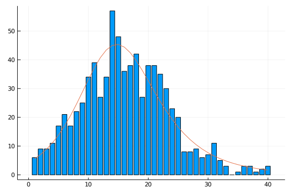
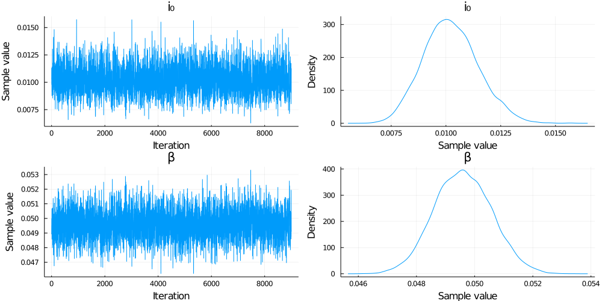
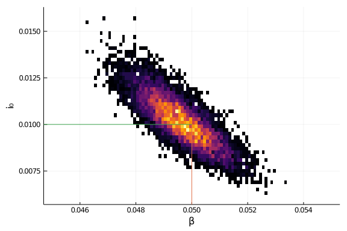

# Ordinary differential equation model with inference using Turing.jl
Simon Frost (@sdwfrost), 2020-05-27

## Introduction

In this notebook, we try to infer the parameter values from a simulated dataset using [Turing.jl](https://turing.ml).

## Libraries

````julia
using DifferentialEquations
using DiffEqSensitivity
using Random
using Distributions
using Turing
using DataFrames
using StatsPlots
````


## The model

The following is a standard SIR model, where we keep track of the cumulative number of infected individuals, `C`.

````julia
function sir_ode!(du,u,p,t)
    (S,I,R,C) = u
    (β,c,γ) = p
    N = S+I+R
    infection = β*c*I/N*S
    recovery = γ*I
    @inbounds begin
        du[1] = -infection
        du[2] = infection - recovery
        du[3] = recovery
        du[4] = infection
    end
    nothing
end;
````


````
sir_ode! (generic function with 1 method)
````


````julia
tmax = 40.0
tspan = (0.0,tmax)
obstimes = 1.0:1.0:tmax
u0 = [990.0,10.0,0.0,0.0] # S,I.R,C
p = [0.05,10.0,0.25]; # β,c,γ
````


````
3-element Array{Float64,1}:
  0.05
 10.0
  0.25
````


````julia
prob_ode = ODEProblem(sir_ode!,u0,tspan,p)
````


````
ODEProblem with uType Array{Float64,1} and tType Float64. In-place: true
timespan: (0.0, 40.0)
u0: [990.0, 10.0, 0.0, 0.0]
````


````julia
sol_ode = solve(prob_ode,
            Tsit5(),
            saveat = 1.0);
````


````
t: 41-element Array{Float64,1}:
  0.0
  1.0
  2.0
  3.0
  4.0
  5.0
  6.0
  7.0
  8.0
  9.0
  ⋮
 32.0
 33.0
 34.0
 35.0
 36.0
 37.0
 38.0
 39.0
 40.0
u: 41-element Array{Array{Float64,1},1}:
 [990.0, 10.0, 0.0, 0.0]
 [984.4093729820466, 12.759075298665039, 2.83155171928832, 5.59062701795335
75]
 [977.3332026510055, 16.22814554943427, 6.438651799560168, 12.6667973489944
34]
 [968.4242204222029, 20.558426973853646, 11.017352603943419, 21.57577957779
7064]
 [957.2822747333526, 25.91440777703591, 16.80331748961151, 32.7177252666474
1]
 [943.4628419127473, 32.463172502357864, 24.073985584894846, 46.53715808725
271]
 [926.497065600148, 40.35593403853616, 33.14700036131587, 63.50293439985202
]
 [905.9269551962524, 49.699931631668576, 44.37311317207904, 84.073044803747
64]
 [881.3585392131616, 60.52139921718387, 58.12006156965444, 108.641460786838
32]
 [852.5274163604042, 72.72290972680412, 74.74967391279168, 137.472583639595
8]
 ⋮
 [233.6919415512116, 44.46580488532527, 721.8422535634633, 756.308058448788
4]
 [228.88046764765463, 38.871629484210395, 732.247902868135, 761.11953235234
55]
 [224.76186839108456, 33.90671598976695, 741.3314156191486, 765.23813160891
54]
 [221.23300305457357, 29.522228842544973, 749.2447681028816, 768.7669969454
265]
 [218.20665229931438, 25.662350534147386, 756.1309971665382, 771.7933477006
857]
 [215.6107449890835, 22.274515459755385, 762.1147395511612, 774.38925501091
65]
 [213.3843905024685, 19.310740281779456, 767.3048692157521, 776.61560949753
15]
 [211.47427574879592, 16.72457203571691, 771.8011522154873, 778.52572425120
41]
 [209.83434778204648, 14.47208748405588, 775.6935647338977, 780.16565221795
35]
````


## Generating data

The data are assumed to be of daily new cases, which we can obtain from the cumulative number, `C`.

````julia
C = Array(sol_ode)[4,:] # Cumulative cases
X = C[2:end] - C[1:(end-1)]
````


````
40-element Array{Float64,1}:
  5.5906270179533575
  7.076170331041077
  8.90898222880263
 11.141945688850349
 13.8194328206053
 16.96577631259931
 20.57011040389561
 24.568415983090688
 28.831122852757474
 33.14329091787582
  ⋮
  5.623429741450877
  4.811473903557044
  4.118599256569951
  3.528865336511103
  3.026350755259159
  2.595907310230814
  2.226354486615037
  1.9101147536725875
  1.639927966749383
````


We generate some random Poisson noise for the measurement error to generate the observations, `Y`.

````julia
Random.seed!(1234)
Y = rand.(Poisson.(X))
````


````
40-element Array{Int64,1}:
  6
  9
  9
 11
 17
 21
 17
 22
 25
 34
  ⋮
  5
  3
  0
  1
  3
  3
  1
  2
  3
````


````julia
bar(obstimes,Y,legend=false)
plot!(obstimes,X,legend=false)
````





## Model specification using Turing

This model estimates the initial proportion of the population that is infected, `i₀`, and the infection probability, `β`, assuming uniform priors on each, with the remaining parameters fixed.

````julia
@model bayes_sir(y) = begin
  # Calculate number of timepoints
  l = length(y)
  i₀  ~ Uniform(0.0,1.0)
  β ~ Uniform(0.0,1.0)
  I = i₀*1000.0
  u0=[1000.0-I,I,0.0,0.0]
  p=[β,10.0,0.25]
  tspan = (0.0,float(l))
  prob = ODEProblem(sir_ode!,
          u0,
          tspan,
          p)
  sol = solve(prob,
              Tsit5(),
              saveat = 1.0)
  sol_C = Array(sol)[4,:] # Cumulative cases
  sol_X = sol_C[2:end] - sol_C[1:(end-1)]
  l = length(y)
  for i in 1:l
    y[i] ~ Poisson(sol_X[i])
  end
end;
````


````
DynamicPPL.ModelGen{Main.##WeaveSandBox#1550.var"###generator#1567",(:y,),(
),Tuple{}}(Main.##WeaveSandBox#1550.##generator#1567, NamedTuple())
````


### Fit using NUTS

The following fits the model using the No U-Turn Sampler.

````julia
ode_nuts = sample(bayes_sir(Y),NUTS(0.65),10000);
````


````
Object of type Chains, with data of type 9000×14×1 Array{Float64,3}

Iterations        = 1:9000
Thinning interval = 1
Chains            = 1
Samples per chain = 9000
internals         = acceptance_rate, hamiltonian_energy, hamiltonian_energy
_error, is_accept, log_density, lp, max_hamiltonian_energy_error, n_steps, 
nom_step_size, numerical_error, step_size, tree_depth
parameters        = i₀, β

2-element Array{ChainDataFrame,1}

Summary Statistics
  parameters    mean     std  naive_se    mcse        ess   r_hat
  ──────────  ──────  ──────  ────────  ──────  ─────────  ──────
          i₀  0.0102  0.0013    0.0000  0.0000  2324.3946  1.0004
           β  0.0496  0.0010    0.0000  0.0000  2400.5829  1.0003

Quantiles
  parameters    2.5%   25.0%   50.0%   75.0%   97.5%
  ──────────  ──────  ──────  ──────  ──────  ──────
          i₀  0.0079  0.0093  0.0101  0.0110  0.0130
           β  0.0476  0.0489  0.0496  0.0503  0.0516
````


The `describe` function displays some summary statistics of the output.

````julia
describe(ode_nuts)
````


````
2-element Array{ChainDataFrame,1}

Summary Statistics
  parameters    mean     std  naive_se    mcse        ess   r_hat
  ──────────  ──────  ──────  ────────  ──────  ─────────  ──────
          i₀  0.0102  0.0013    0.0000  0.0000  2324.3946  1.0004
           β  0.0496  0.0010    0.0000  0.0000  2400.5829  1.0003

Quantiles
  parameters    2.5%   25.0%   50.0%   75.0%   97.5%
  ──────────  ──────  ──────  ──────  ──────  ──────
          i₀  0.0079  0.0093  0.0101  0.0110  0.0130
           β  0.0476  0.0489  0.0496  0.0503  0.0516
````


````julia
plot(ode_nuts)
````





### Further plotting

The MCMC chains can be converted into a `DataFrame` for further plotting.

````julia
posterior = DataFrame(ode_nuts);
````


````
9000×2 DataFrame
│ Row  │ i₀         │ β         │
│      │ Float64    │ Float64   │
├──────┼────────────┼───────────┤
│ 1    │ 0.0116984  │ 0.0497058 │
│ 2    │ 0.0119372  │ 0.049948  │
│ 3    │ 0.00877592 │ 0.0495623 │
│ 4    │ 0.0103578  │ 0.0504764 │
│ 5    │ 0.0103578  │ 0.0504764 │
│ 6    │ 0.00969228 │ 0.0505629 │
│ 7    │ 0.00936509 │ 0.0507761 │
⋮
│ 8993 │ 0.0105959  │ 0.0484405 │
│ 8994 │ 0.00876928 │ 0.0505727 │
│ 8995 │ 0.0107183  │ 0.0488594 │
│ 8996 │ 0.0107306  │ 0.0487891 │
│ 8997 │ 0.010865   │ 0.0493283 │
│ 8998 │ 0.010865   │ 0.0493283 │
│ 8999 │ 0.0116133  │ 0.0485315 │
│ 9000 │ 0.0100491  │ 0.0492625 │
````


````julia
histogram2d(posterior[!,:β],posterior[!,:i₀],
                bins=80,
                xlabel="β",
                ylab="i₀",
                ylim=[0.006,0.016],
                xlim=[0.045,0.055],
                legend=false)
plot!([0.05,0.05],[0.0,0.01])
plot!([0.0,0.05],[0.01,0.01])
````





### Generate predictions

The following code generates predicted dynamics by sampling parameter values from the posterior distribution and running the model.

````julia
function predict(y,chain)
    # Length of data
    l = length(y)
    # Length of chain
    m = length(chain)
    # Choose random
    idx = sample(1:m)
    i₀ = chain[:i₀].value[idx]
    β = chain[:β].value[idx]
    I = i₀*1000.0
    u0=[1000.0-I,I,0.0,0.0]
    p=[β,10.0,0.25]
    tspan = (0.0,float(l))
    prob = ODEProblem(sir_ode!,
            u0,
            tspan,
            p)
    sol = concrete_solve(prob,
                Tsit5(),
                saveat = 1.0)
    out = Array(sol)
    sol_X = [0.0; out[4,2:end] - out[4,1:(end-1)]]
    hcat(sol_ode.t,out',sol_X)
end;
````


````
predict (generic function with 1 method)
````


Here is a plot of ten samples of the posterior for the number of daily cases against the simulated data.

````julia
Xp = []
for i in 1:10
    pred = predict(Y,ode_nuts)
    push!(Xp,pred[2:end,6])
end
````


````julia
scatter(obstimes,Y,legend=false)
plot!(obstimes,Xp,legend=false)
````


## Appendix
### Computer Information
```
Julia Version 1.4.1
Commit 381693d3df* (2020-04-14 17:20 UTC)
Platform Info:
  OS: Linux (x86_64-pc-linux-gnu)
  CPU: Intel(R) Core(TM) i7-1065G7 CPU @ 1.30GHz
  WORD_SIZE: 64
  LIBM: libopenlibm
  LLVM: libLLVM-8.0.1 (ORCJIT, icelake-client)
Environment:
  JULIA_NUM_THREADS = 4

```

### Package Information

```
Status `~/.julia/environments/v1.4/Project.toml`
[46ada45e-f475-11e8-01d0-f70cc89e6671] Agents 3.1.0
[f5f396d3-230c-5e07-80e6-9fadf06146cc] ApproxBayes 0.3.2
[c52e3926-4ff0-5f6e-af25-54175e0327b1] Atom 0.12.11
[6e4b80f9-dd63-53aa-95a3-0cdb28fa8baf] BenchmarkTools 0.5.0
[a134a8b2-14d6-55f6-9291-3336d3ab0209] BlackBoxOptim 0.5.0
[2445eb08-9709-466a-b3fc-47e12bd697a2] DataDrivenDiffEq 0.3.1
[a93c6f00-e57d-5684-b7b6-d8193f3e46c0] DataFrames 0.21.1
[ebbdde9d-f333-5424-9be2-dbf1e9acfb5e] DiffEqBayes 2.14.1
[459566f4-90b8-5000-8ac3-15dfb0a30def] DiffEqCallbacks 2.13.2
[aae7a2af-3d4f-5e19-a356-7da93b79d9d0] DiffEqFlux 1.10.3
[c894b116-72e5-5b58-be3c-e6d8d4ac2b12] DiffEqJump 6.7.5
[1130ab10-4a5a-5621-a13d-e4788d82bd4c] DiffEqParamEstim 1.14.1
[41bf760c-e81c-5289-8e54-58b1f1f8abe2] DiffEqSensitivity 6.17.0
[0c46a032-eb83-5123-abaf-570d42b7fbaa] DifferentialEquations 6.14.0
[b4f34e82-e78d-54a5-968a-f98e89d6e8f7] Distances 0.8.2
[31c24e10-a181-5473-b8eb-7969acd0382f] Distributions 0.23.2
[634d3b9d-ee7a-5ddf-bec9-22491ea816e1] DrWatson 1.13.0
[587475ba-b771-5e3f-ad9e-33799f191a9c] Flux 0.10.5
[28b8d3ca-fb5f-59d9-8090-bfdbd6d07a71] GR 0.49.1
[523d8e89-b243-5607-941c-87d699ea6713] Gillespie 0.1.0
[e850a1a4-d859-11e8-3d54-a195e6d045d3] GpABC 0.0.1
[7073ff75-c697-5162-941a-fcdaad2a7d2a] IJulia 1.21.2
[4076af6c-e467-56ae-b986-b466b2749572] JuMP 0.21.2
[e5e0dc1b-0480-54bc-9374-aad01c23163d] Juno 0.8.2
[093fc24a-ae57-5d10-9952-331d41423f4d] LightGraphs 1.3.3
[1914dd2f-81c6-5fcd-8719-6d5c9610ff09] MacroTools 0.5.5
[961ee093-0014-501f-94e3-6117800e7a78] ModelingToolkit 3.6.4
[76087f3c-5699-56af-9a33-bf431cd00edd] NLopt 0.6.0
[429524aa-4258-5aef-a3af-852621145aeb] Optim 0.20.6
[1dea7af3-3e70-54e6-95c3-0bf5283fa5ed] OrdinaryDiffEq 5.38.2
[91a5bcdd-55d7-5caf-9e0b-520d859cae80] Plots 1.3.4
[428bdadb-6287-5aa5-874b-9969638295fd] SimJulia 0.8.0
[05bca326-078c-5bf0-a5bf-ce7c7982d7fd] SimpleDiffEq 1.1.0
[276daf66-3868-5448-9aa4-cd146d93841b] SpecialFunctions 0.10.3
[f3b207a7-027a-5e70-b257-86293d7955fd] StatsPlots 0.14.6
[789caeaf-c7a9-5a7d-9973-96adeb23e2a0] StochasticDiffEq 6.23.0
[92b13dbe-c966-51a2-8445-caca9f8a7d42] TaylorIntegration 0.8.3
[fce5fe82-541a-59a6-adf8-730c64b5f9a0] Turing 0.13.0
[44d3d7a6-8a23-5bf8-98c5-b353f8df5ec9] Weave 0.10.2
[e88e6eb3-aa80-5325-afca-941959d7151f] Zygote 0.4.20
```
