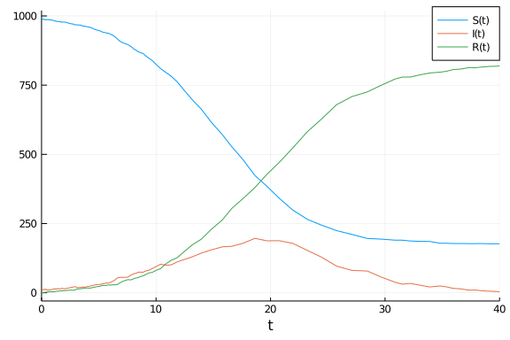
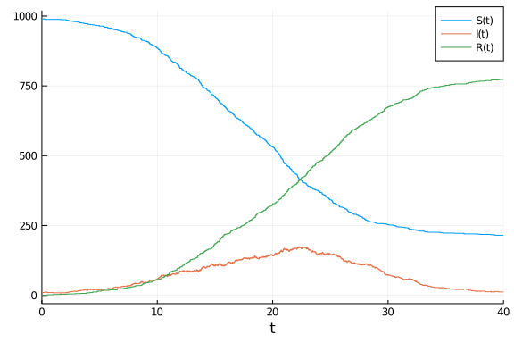

# Reaction network model using ModelingToolkit
Simon Frost (@sdwfrost), 2020-05-20

## Introduction

One high-level representation of the SIR model is as a reaction network, borrowed from systems biology. [ModelingToolkit](https://mtk.sciml.ai/) allows us to convert this representation to ODEs, SDEs, and jump processes. This example is a slightly tweaked version of [one in the ModelingToolkit documentation](https://mtk.sciml.ai/dev/systems/ReactionSystem/), using the population size as a derived variable in the rates for the transitions.

## Libraries

````julia
using DifferentialEquations
using ModelingToolkit
using OrdinaryDiffEq
using StochasticDiffEq
using DiffEqJump
using Random
using Plots
````


## Transitions

````julia
@parameters t β c γ
@variables S(t) I(t) R(t)

N=S+I+R # This is recognized as a derived variable
rxs = [Reaction((β*c)/N, [S,I], [I], [1,1], [2])
       Reaction(γ, [I], [R])]
````


````
2-element Array{ModelingToolkit.Reaction{ModelingToolkit.Variable,Int64},1}
:
 ModelingToolkit.Reaction{ModelingToolkit.Variable,Int64}((β * c) / ((S(t) 
+ I(t)) + R(t)), ModelingToolkit.Operation[S(t), I(t)], ModelingToolkit.Ope
ration[I(t)], [1, 1], [2], Pair{ModelingToolkit.Variable,Int64}[I => 1, S =
> -1], false)
 ModelingToolkit.Reaction{ModelingToolkit.Variable,Int64}(γ, ModelingToolki
t.Operation[I(t)], ModelingToolkit.Operation[R(t)], [1], [1], Pair{Modeling
Toolkit.Variable,Int64}[R => 1, I => -1], false)
````


````julia
rs  = ReactionSystem(rxs, t, [S,I,R], [β,c,γ])
````


````
ModelingToolkit.ReactionSystem(ModelingToolkit.Reaction[ModelingToolkit.Rea
ction{ModelingToolkit.Variable,Int64}((β * c) / ((S(t) + I(t)) + R(t)), Mod
elingToolkit.Operation[S(t), I(t)], ModelingToolkit.Operation[I(t)], [1, 1]
, [2], Pair{ModelingToolkit.Variable,Int64}[I => 1, S => -1], false), Model
ingToolkit.Reaction{ModelingToolkit.Variable,Int64}(γ, ModelingToolkit.Oper
ation[I(t)], ModelingToolkit.Operation[R(t)], [1], [1], Pair{ModelingToolki
t.Variable,Int64}[R => 1, I => -1], false)], t, ModelingToolkit.Variable[S,
 I, R], ModelingToolkit.Variable[β, c, γ], Symbol("##ReactionSystem#1713"),
 ModelingToolkit.ReactionSystem[])
````


## Time domain

We set the timespan for simulations, `tspan`, initial conditions, `u0`, and parameter values, `p` (which are unpacked above as `[β,γ]`).

````julia
tmax = 40.0
tspan = (0.0,tmax);
````


````
(0.0, 40.0)
````


## Initial conditions

In `ModelingToolkit`, the initial values are defined by a dictionary.

````julia
u0 = [S => 990.0,
      I => 10.0,
      R => 0.0];
````


````
3-element Array{Pair{ModelingToolkit.Operation,Float64},1}:
 S(t) => 990.0
 I(t) => 10.0
 R(t) => 0.0
````


## Parameter values

Similarly, the parameter values are defined by a dictionary.

````julia
p = [β=>0.05,
     c=>10.0,
     γ=>0.25];
````


````
3-element Array{Pair{ModelingToolkit.Operation,Float64},1}:
 β => 0.05
 c => 10.0
 γ => 0.25
````


## Random number seed

````julia
Random.seed!(1234);
````


````
Random.MersenneTwister(UInt32[0x000004d2], Random.DSFMT.DSFMT_state(Int32[-
1393240018, 1073611148, 45497681, 1072875908, 436273599, 1073674613, -20437
16458, 1073445557, -254908435, 1072827086  …  -599655111, 1073144102, 36765
5457, 1072985259, -1278750689, 1018350124, -597141475, 249849711, 382, 0]),
 [0.0, 0.0, 0.0, 0.0, 0.0, 0.0, 0.0, 0.0, 0.0, 0.0  …  0.0, 0.0, 0.0, 0.0, 
0.0, 0.0, 0.0, 0.0, 0.0, 0.0], UInt128[0x00000000000000000000000000000000, 
0x00000000000000000000000000000000, 0x00000000000000000000000000000000, 0x0
0000000000000000000000000000000, 0x00000000000000000000000000000000, 0x0000
0000000000000000000000000000, 0x00000000000000000000000000000000, 0x0000000
0000000000000000000000000, 0x00000000000000000000000000000000, 0x0000000000
0000000000000000000000  …  0x00000000000000000000000000000000, 0x0000000000
0000000000000000000000, 0x00000000000000000000000000000000, 0x0000000000000
0000000000000000000, 0x00000000000000000000000000000000, 0x0000000000000000
0000000000000000, 0x00000000000000000000000000000000, 0x0000000000000000000
0000000000000, 0x00000000000000000000000000000000, 0x0000000000000000000000
0000000000], 1002, 0)
````


## Generating and running models

### As ODEs

````julia
odesys = convert(ODESystem, rs)
oprob = ODEProblem(odesys, u0, tspan, p)
osol = solve(oprob, Tsit5())
plot(osol)
````


### As SDEs

````julia
sdesys = convert(SDESystem, rs)
sprob = SDEProblem(sdesys, u0, tspan, p)
ssol = solve(sprob, SRA1())
plot(ssol)
````





### As jump process

To convert to a jump process, we need to set the initial conditions to `Int` rather than `Float`.

````julia
jumpsys = convert(JumpSystem, rs)
u0i = [S => 990, I => 10, R => 0]
dprob = DiscreteProblem(jumpsys, u0i, tspan, p)
jprob = JumpProblem(jumpsys, dprob, Direct())
jsol = solve(jprob, SSAStepper())
plot(jsol)
````





## Appendix
### Computer Information
```
Julia Version 1.4.1
Commit 381693d3df* (2020-04-14 17:20 UTC)
Platform Info:
  OS: Linux (x86_64-pc-linux-gnu)
  CPU: Intel(R) Core(TM) i7-1065G7 CPU @ 1.30GHz
  WORD_SIZE: 64
  LIBM: libopenlibm
  LLVM: libLLVM-8.0.1 (ORCJIT, icelake-client)
Environment:
  JULIA_NUM_THREADS = 4

```

### Package Information

```
Status `~/.julia/environments/v1.4/Project.toml`
[46ada45e-f475-11e8-01d0-f70cc89e6671] Agents 3.1.0
[f5f396d3-230c-5e07-80e6-9fadf06146cc] ApproxBayes 0.3.2
[c52e3926-4ff0-5f6e-af25-54175e0327b1] Atom 0.12.14
[fbb218c0-5317-5bc6-957e-2ee96dd4b1f0] BSON 0.2.6
[6e4b80f9-dd63-53aa-95a3-0cdb28fa8baf] BenchmarkTools 0.5.0
[a134a8b2-14d6-55f6-9291-3336d3ab0209] BlackBoxOptim 0.5.0
[2d3116d5-4b8f-5680-861c-71f149790274] Bridge 0.11.3
[1aa9af3a-2424-508f-bb7e-0626de155470] BridgeDiffEq 0.1.0
[46d747a0-b9e1-11e9-14b5-615c73e45078] BridgeSDEInference 0.3.2
[336ed68f-0bac-5ca0-87d4-7b16caf5d00b] CSV 0.6.2
[49dc2e85-a5d0-5ad3-a950-438e2897f1b9] Calculus 0.5.1
[2445eb08-9709-466a-b3fc-47e12bd697a2] DataDrivenDiffEq 0.3.1
[a93c6f00-e57d-5684-b7b6-d8193f3e46c0] DataFrames 0.21.2
[bcd4f6db-9728-5f36-b5f7-82caef46ccdb] DelayDiffEq 5.24.1
[2b5f629d-d688-5b77-993f-72d75c75574e] DiffEqBase 6.36.4
[ebbdde9d-f333-5424-9be2-dbf1e9acfb5e] DiffEqBayes 2.15.0
[eb300fae-53e8-50a0-950c-e21f52c2b7e0] DiffEqBiological 4.3.0
[459566f4-90b8-5000-8ac3-15dfb0a30def] DiffEqCallbacks 2.13.2
[aae7a2af-3d4f-5e19-a356-7da93b79d9d0] DiffEqFlux 1.12.0
[c894b116-72e5-5b58-be3c-e6d8d4ac2b12] DiffEqJump 6.8.2
[1130ab10-4a5a-5621-a13d-e4788d82bd4c] DiffEqParamEstim 1.14.1
[41bf760c-e81c-5289-8e54-58b1f1f8abe2] DiffEqSensitivity 6.19.1
[0c46a032-eb83-5123-abaf-570d42b7fbaa] DifferentialEquations 6.14.0
[b4f34e82-e78d-54a5-968a-f98e89d6e8f7] Distances 0.8.2
[31c24e10-a181-5473-b8eb-7969acd0382f] Distributions 0.23.4
[634d3b9d-ee7a-5ddf-bec9-22491ea816e1] DrWatson 1.13.1
[587475ba-b771-5e3f-ad9e-33799f191a9c] Flux 0.10.5
[f6369f11-7733-5829-9624-2563aa707210] ForwardDiff 0.10.10
[38e38edf-8417-5370-95a0-9cbb8c7f171a] GLM 1.3.9
[28b8d3ca-fb5f-59d9-8090-bfdbd6d07a71] GR 0.49.1
[891a1506-143c-57d2-908e-e1f8e92e6de9] GaussianProcesses 0.12.0
[523d8e89-b243-5607-941c-87d699ea6713] Gillespie 0.1.0
[e850a1a4-d859-11e8-3d54-a195e6d045d3] GpABC 0.0.1
[7073ff75-c697-5162-941a-fcdaad2a7d2a] IJulia 1.21.2
[a98d9a8b-a2ab-59e6-89dd-64a1c18fca59] Interpolations 0.12.10
[4076af6c-e467-56ae-b986-b466b2749572] JuMP 0.21.2
[e5e0dc1b-0480-54bc-9374-aad01c23163d] Juno 0.8.2
[093fc24a-ae57-5d10-9952-331d41423f4d] LightGraphs 1.3.3
[c7f686f2-ff18-58e9-bc7b-31028e88f75d] MCMCChains 3.0.12
[1914dd2f-81c6-5fcd-8719-6d5c9610ff09] MacroTools 0.5.5
[5424a776-8be3-5c5b-a13f-3551f69ba0e6] Mamba 0.12.4
[ff71e718-51f3-5ec2-a782-8ffcbfa3c316] MixedModels 3.0.0-DEV
[961ee093-0014-501f-94e3-6117800e7a78] ModelingToolkit 3.8.0
[76087f3c-5699-56af-9a33-bf431cd00edd] NLopt 0.6.0
[429524aa-4258-5aef-a3af-852621145aeb] Optim 0.20.6
[1dea7af3-3e70-54e6-95c3-0bf5283fa5ed] OrdinaryDiffEq 5.39.1
[91a5bcdd-55d7-5caf-9e0b-520d859cae80] Plots 1.3.7
[c3e4b0f8-55cb-11ea-2926-15256bba5781] Pluto 0.9.4
[1a8c2f83-1ff3-5112-b086-8aa67b057ba1] Query 0.12.3-DEV
[6f49c342-dc21-5d91-9882-a32aef131414] RCall 0.13.7
[c5292f4c-5179-55e1-98c5-05642aab7184] ResumableFunctions 0.5.1
[37e2e3b7-166d-5795-8a7a-e32c996b4267] ReverseDiff 1.2.0
[428bdadb-6287-5aa5-874b-9969638295fd] SimJulia 0.8.0
[05bca326-078c-5bf0-a5bf-ce7c7982d7fd] SimpleDiffEq 1.1.0
[276daf66-3868-5448-9aa4-cd146d93841b] SpecialFunctions 0.10.3
[2913bbd2-ae8a-5f71-8c99-4fb6c76f3a91] StatsBase 0.33.0
[f3b207a7-027a-5e70-b257-86293d7955fd] StatsPlots 0.14.6
[8188c328-b5d6-583d-959b-9690869a5511] Stheno 0.6.4
[789caeaf-c7a9-5a7d-9973-96adeb23e2a0] StochasticDiffEq 6.23.1
[92b13dbe-c966-51a2-8445-caca9f8a7d42] TaylorIntegration 0.8.3
[9f7883ad-71c0-57eb-9f7f-b5c9e6d3789c] Tracker 0.2.6
[fce5fe82-541a-59a6-adf8-730c64b5f9a0] Turing 0.13.0
[1986cc42-f94f-5a68-af5c-568840ba703d] Unitful 1.2.1
[44d3d7a6-8a23-5bf8-98c5-b353f8df5ec9] Weave 0.10.2
[e88e6eb3-aa80-5325-afca-941959d7151f] Zygote 0.4.20
```
